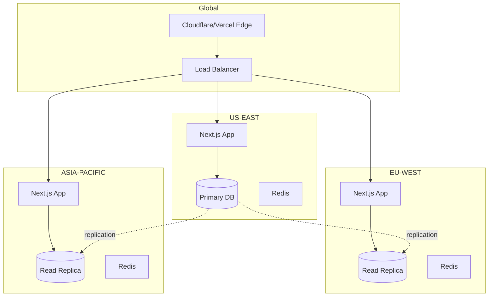
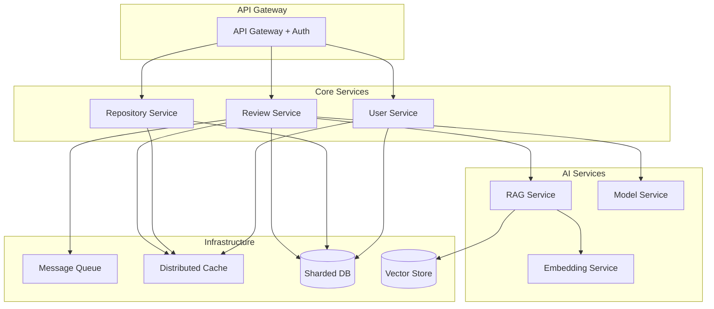

# 🚀 ReviewyAI Scaling Strategy

> **A comprehensive roadmap for scaling ReviewyAI from 100 to 100,000+ users**

---

## Executive Summary

ReviewyAI is an AI-powered code review platform built on Next.js, PostgreSQL, Pinecone, and Inngest. This document outlines a strategic scaling plan across four phases, addressing infrastructure, database, AI processing, event queues, caching, and monitoring.

**Current Architecture:**
- **Frontend**: Next.js 16 (App Router) hosted on Vercel
- **Database**: PostgreSQL with Prisma ORM
- **Vector Store**: Pinecone for RAG-based code context
- **Event Queue**: Inngest for async review processing
- **Auth**: Better Auth with session management
- **AI**: Google Gemini 2.5 Flash for code reviews
- **Payments**: Polar SDK for subscription management

---

## 📊 Scaling Dimensions

### Key Metrics to Scale
| Metric | Current (Phase 1) | Target (Phase 4) | Growth Factor |
|--------|-------------------|------------------|---------------|
| **Daily Active Users** | 100-500 | 50,000+ | 100x |
| **Repositories** | 1,000 | 500,000+ | 500x |
| **PR Reviews/Day** | 1,000 | 100,000+ | 100x |
| **Database Size** | 10 GB | 5 TB+ | 500x |
| **API Requests/sec** | 10 | 1,000+ | 100x |
| **Concurrent Reviews** | 5 | 500+ | 100x |

---

## 🏗️ Phase 1: Foundation (0-1K Users)

### Current State Assessment
✅ **Working Well:**
- Serverless deployment on Vercel
- PostgreSQL with connection pooling
- Inngest with concurrency limit of 5
- RAG-based context retrieval with Pinecone

⚠️ **Immediate Bottlenecks:**
- Single PostgreSQL instance (no read replicas)
- Limited Inngest concurrency (5)
- No caching layer
- Missing rate limiting
- No database indexes optimization

### Actions Required

#### 1.1 Database Optimization
```sql
-- Add critical indexes for performance
CREATE INDEX CONCURRENTLY idx_review_created_at ON review(created_at DESC);
CREATE INDEX CONCURRENTLY idx_review_status ON review(status);
CREATE INDEX CONCURRENTLY idx_repository_user_owner ON repository(userId, owner);
CREATE INDEX CONCURRENTLY idx_user_usage_updated ON user_usage(updatedAt DESC);

-- Add composite indexes for common queries
CREATE INDEX CONCURRENTLY idx_review_repo_pr ON review(repositoryId, prNumber);
CREATE INDEX CONCURRENTLY idx_session_token_expires ON session(token, expiresAt);
```

#### 1.2 Connection Pooling
**Implement PgBouncer or Prisma Data Proxy**

```typescript
// prisma.config.ts - Enhanced
import { PrismaClient } from '@/lib/generated/prisma';
import { Pool } from 'pg';

const connectionLimit = process.env.DATABASE_CONNECTION_LIMIT 
  ? parseInt(process.env.DATABASE_CONNECTION_LIMIT) 
  : 20;

export const prisma = new PrismaClient({
  datasources: {
    db: {
      url: process.env.DATABASE_URL,
    },
  },
  log: ['error', 'warn'],
}).$extends({
  query: {
    $allOperations({ operation, model, args, query }) {
      const start = Date.now();
      const result = query(args);
      const end = Date.now();
      console.log(`${model}.${operation} took ${end - start}ms`);
      return result;
    },
  },
});

// Connection pooling configuration
const pool = new Pool({
  connectionString: process.env.DATABASE_URL,
  max: connectionLimit,
  idleTimeoutMillis: 30000,
  connectionTimeoutMillis: 2000,
});
```

#### 1.3 Rate Limiting
**Implement Redis-backed rate limiting**

```typescript
// lib/rate-limit.ts - NEW FILE
import { Redis } from '@upstash/redis';

const redis = new Redis({
  url: process.env.UPSTASH_REDIS_URL!,
  token: process.env.UPSTASH_REDIS_TOKEN!,
});

export async function rateLimit(
  identifier: string,
  limit: number,
  window: number
): Promise<{ success: boolean; remaining: number }> {
  const key = `ratelimit:${identifier}`;
  const current = await redis.incr(key);
  
  if (current === 1) {
    await redis.expire(key, window);
  }
  
  const remaining = Math.max(0, limit - current);
  return { success: current <= limit, remaining };
}

// Tier-based limits
export const RATE_LIMITS = {
  FREE: { reviews: 10, window: 86400 },    // 10/day
  PRO: { reviews: 100, window: 86400 },    // 100/day
  TEAM: { reviews: 500, window: 86400 },   // 500/day
  ENTERPRISE: { reviews: -1, window: 0 },  // unlimited
};
```

#### 1.4 Caching Layer
**Redis for session and metadata caching**

```typescript
// lib/cache.ts - NEW FILE
import { Redis } from '@upstash/redis';

const cache = new Redis({
  url: process.env.UPSTASH_REDIS_URL!,
  token: process.env.UPSTASH_REDIS_TOKEN!,
});

export async function getCached<T>(key: string): Promise<T | null> {
  return await cache.get(key);
}

export async function setCached<T>(
  key: string, 
  value: T, 
  ttl: number = 3600
): Promise<void> {
  await cache.set(key, value, { ex: ttl });
}

export async function deleteCached(key: string): Promise<void> {
  await cache.del(key);
}

// Cache patterns
export const CACHE_KEYS = {
  user: (id: string) => `user:${id}`,
  userUsage: (id: string) => `usage:${id}`,
  repository: (id: string) => `repo:${id}`,
  review: (id: string) => `review:${id}`,
};
```

#### 1.5 Monitoring Setup
**Implement observability from day one**

```bash
# Required services
- Vercel Analytics (included)
- Sentry for error tracking
- Prisma Pulse for database monitoring
- Inngest event tracking dashboard
- Uptime monitoring (BetterStack/UptimeRobot)
```

### Phase 1 Metrics & Triggers
| Metric | Threshold | Action |
|--------|-----------|--------|
| Database Connections | > 80% | Add connection pooler |
| API Response Time | > 2s | Add caching |
| Review Queue Depth | > 100 | Increase Inngest concurrency |
| Error Rate | > 1% | Scale down and debug |

---

## 🔥 Phase 2: Growth (1K-10K Users)

### Scaling Challenges
- Increased database load
- Higher review throughput requirements
- Growing vector store queries
- Session management at scale

### Actions Required

#### 2.1 Database Read Replicas
**Separate read/write traffic**

```typescript
// lib/prisma-replicas.ts - NEW FILE
import { PrismaClient } from '@/lib/generated/prisma';

export const prismaWrite = new PrismaClient({
  datasources: { db: { url: process.env.DATABASE_URL } },
});

export const prismaRead = new PrismaClient({
  datasources: { db: { url: process.env.DATABASE_READ_REPLICA_URL } },
});

// Usage pattern
export async function getUser(id: string) {
  return await prismaRead.user.findUnique({ where: { id } });
}

export async function updateUser(id: string, data: any) {
  return await prismaWrite.user.update({ where: { id }, data });
}
```

#### 2.2 Inngest Concurrency Scaling
**Increase concurrent review processing**

```typescript
// inngest/functions/review.ts - MODIFY
export const generateReview = inngest.createFunction(
    {
        id: "generate-review",
        concurrency: [
          { limit: 50, key: "event.data.userId" },        // 50 per user
          { limit: 200, scope: "account" }                // 200 total
        ],
        rateLimit: {
          limit: 1000,
          period: "1h",
          key: "event.data.userId"
        }
    },
    { event: "pr.review.requested" },
    async ({ event, step }) => {
        // existing implementation
    }
);
```

#### 2.3 Intelligent Caching Strategy
**Multi-layer caching**

```typescript
// module/repository/lib/cache.ts - NEW FILE
export async function getRepositoryWithCache(id: string) {
  const cacheKey = CACHE_KEYS.repository(id);
  const cached = await getCached(cacheKey);
  
  if (cached) return cached;
  
  const repo = await prismaRead.repository.findUnique({
    where: { id },
    include: { user: true },
  });
  
  if (repo) {
    await setCached(cacheKey, repo, 3600); // 1 hour
  }
  
  return repo;
}

// Cache invalidation on updates
export async function updateRepository(id: string, data: any) {
  const updated = await prismaWrite.repository.update({
    where: { id },
    data,
  });
  
  await deleteCached(CACHE_KEYS.repository(id));
  return updated;
}
```

#### 2.4 Pinecone Optimization
**Namespace isolation and query optimization**

```typescript
// lib/pinecone.ts - ENHANCE
import { Pinecone } from '@pinecone-database/pinecone';

const pc = new Pinecone({
  apiKey: process.env.PINECONE_API_KEY!,
});

// Use namespaces for tenant isolation
export async function getIndex(namespace: string) {
  return pc.index(process.env.PINECONE_INDEX_NAME!, namespace);
}

// Batch upserts for efficiency
export async function batchUpsertVectors(
  namespace: string,
  vectors: any[],
  batchSize = 100
) {
  const index = await getIndex(namespace);
  
  for (let i = 0; i < vectors.length; i += batchSize) {
    const batch = vectors.slice(i, i + batchSize);
    await index.upsert(batch);
  }
}
```

#### 2.5 CDN & Asset Optimization
**Vercel Edge Network + Image Optimization**

```typescript
// next.config.ts - ENHANCE
import type { NextConfig } from "next";

const nextConfig: NextConfig = {
  images: {
    formats: ['image/avif', 'image/webp'],
    deviceSizes: [640, 750, 828, 1080, 1200],
    imageSizes: [16, 32, 48, 64, 96],
    remotePatterns: [
      { protocol: 'https', hostname: 'avatars.githubusercontent.com' },
    ],
  },
  experimental: {
    ppr: true, // Partial Prerendering
  },
  compress: true,
  poweredByHeader: false,
};

export default nextConfig;
```

### Phase 2 Metrics & Triggers
| Metric | Threshold | Action |
|--------|-----------|--------|
| Read Replica Lag | > 5s | Add more replicas |
| Review Queue Time | > 5min | Increase concurrency |
| Cache Hit Rate | < 70% | Optimize cache strategy |
| Pinecone P95 Latency | > 500ms | Add query caching |

---

## 🚀 Phase 3: Scale (10K-50K Users)

### Scaling Challenges
- Multi-region deployment
- Database sharding considerations
- AI model optimization
- Cost optimization

### Actions Required

#### 3.1 Database Sharding Strategy
**Shard by user ID for horizontal scaling**

```typescript
// lib/prisma-shards.ts - NEW FILE
import { PrismaClient } from '@/lib/generated/prisma';

const SHARD_COUNT = 4;

function getShardIndex(userId: string): number {
  const hash = userId.split('').reduce((acc, char) => 
    acc + char.charCodeAt(0), 0
  );
  return hash % SHARD_COUNT;
}

export function getPrismaClient(userId: string): PrismaClient {
  const shardIndex = getShardIndex(userId);
  const shardUrl = process.env[`DATABASE_SHARD_${shardIndex}_URL`];
  
  return new PrismaClient({
    datasources: { db: { url: shardUrl } },
  });
}

// Global lookup table for cross-shard queries
export const prismaGlobal = new PrismaClient({
  datasources: { db: { url: process.env.DATABASE_GLOBAL_URL } },
});
```

#### 3.2 AI Model Optimization
**Implement model routing and cost control**

```typescript
// module/ai/lib/model-router.ts - NEW FILE
import { google } from '@ai-sdk/google';

export type ReviewComplexity = 'simple' | 'medium' | 'complex';

export function analyzeComplexity(diff: string): ReviewComplexity {
  const lines = diff.split('\n').length;
  const fileCount = (diff.match(/diff --git/g) || []).length;
  
  if (lines < 100 && fileCount <= 2) return 'simple';
  if (lines < 500 && fileCount <= 10) return 'medium';
  return 'complex';
}

export function getModelForComplexity(complexity: ReviewComplexity) {
  switch (complexity) {
    case 'simple':
      return google('gemini-2.5-flash');     // Fast, cheap
    case 'medium':
      return google('gemini-2.5-flash');     // Balanced
    case 'complex':
      return google('gemini-2.5-pro');       // Premium, expensive
  }
}

// Usage in review.ts
const complexity = analyzeComplexity(diff);
const model = getModelForComplexity(complexity);
const { text } = await generateText({ model, prompt });
```

#### 3.3 Background Job Optimization
**Priority queues and retry strategies**

```typescript
// inngest/functions/review.ts - ENHANCE
export const generateReview = inngest.createFunction(
    {
        id: "generate-review",
        concurrency: [
          { limit: 100, key: "event.data.userId" },
          { limit: 500, scope: "account" }
        ],
        retries: 3,
        priority: {
          run: "event.data.tier === 'ENTERPRISE' ? 100 : 50"
        }
    },
    { event: "pr.review.requested" },
    async ({ event, step }) => {
        // Add timeout for long-running reviews
        const timeout = event.data.tier === 'ENTERPRISE' ? 300000 : 120000;
        
        return await step.run("generate-ai-review", async () => {
            // implementation with timeout
        }, { timeout });
    }
);
```

#### 3.4 Multi-Region Deployment
**Edge deployment with regional databases**



#### 3.5 Advanced Monitoring
**Distributed tracing and APM**

```typescript
// lib/monitoring.ts - NEW FILE
import * as Sentry from '@sentry/nextjs';
import { trace } from '@opentelemetry/api';

export function initMonitoring() {
  Sentry.init({
    dsn: process.env.SENTRY_DSN,
    tracesSampleRate: 0.1,
    profilesSampleRate: 0.1,
    integrations: [
      new Sentry.Integrations.Prisma({ client: prisma }),
    ],
  });
}

// Custom metrics
export async function trackReviewMetrics(
  userId: string,
  duration: number,
  complexity: string
) {
  // Send to monitoring service
  await fetch(process.env.METRICS_ENDPOINT!, {
    method: 'POST',
    body: JSON.stringify({
      metric: 'review.completed',
      userId,
      duration,
      complexity,
      timestamp: Date.now(),
    }),
  });
}
```

### Phase 3 Metrics & Triggers
| Metric | Threshold | Action |
|--------|-----------|--------|
| Global Response Time | > 500ms | Add regional edge |
| AI Cost per Review | > $0.10 | Optimize model usage |
| Database Shard Imbalance | > 30% | Rebalance shards |
| Job Failure Rate | > 5% | Improve retry logic |

---

## 🌍 Phase 4: Enterprise (50K+ Users)

### Scaling Challenges
- Massive concurrent operations
- Cost optimization at scale
- High availability (99.99%)
- Enterprise compliance & security

### Actions Required

#### 4.1 Microservices Architecture
**Decompose monolith into specialized services**



#### 4.2 Database Architecture Evolution
**Move to distributed SQL (CockroachDB/YugabyteDB)**

```sql
-- Multi-region setup with CockroachDB
ALTER DATABASE reviewyai CONFIGURE ZONE USING 
  num_replicas = 5,
  constraints = '{
    "+region=us-east": 2,
    "+region=eu-west": 2,
    "+region=asia-pacific": 1
  }';

-- Partition reviews table by created date
CREATE TABLE review_partitioned (
  id TEXT,
  repository_id TEXT,
  pr_number INT,
  created_at TIMESTAMP,
  -- other fields
  PRIMARY KEY (created_at, id)
) PARTITION BY RANGE (created_at);

-- Create partitions for each month
CREATE TABLE review_2026_01 PARTITION OF review_partitioned
  FOR VALUES FROM ('2026-01-01') TO ('2026-02-01');
```

#### 4.3 AI Infrastructure Optimization
**Self-hosted models + inference caching**

```typescript
// module/ai/lib/model-cache.ts - NEW FILE
import { createHash } from 'crypto';

export async function getCachedReview(
  diff: string,
  context: string[]
): Promise<string | null> {
  const cacheKey = createHash('sha256')
    .update(diff + context.join(''))
    .digest('hex');
  
  return await getCached(`ai:review:${cacheKey}`);
}

export async function cacheReview(
  diff: string,
  context: string[],
  review: string
): Promise<void> {
  const cacheKey = createHash('sha256')
    .update(diff + context.join(''))
    .digest('hex');
  
  await setCached(`ai:review:${cacheKey}`, review, 604800); // 7 days
}

// Deduplicate similar PRs
export function calculateSimilarity(diff1: string, diff2: string): number {
  // Implement fuzzy matching or embeddings comparison
  // Return similarity score 0-1
}
```

#### 4.4 Event-Driven Architecture
**Migrate from Inngest to Kafka/RabbitMQ for max throughput**

```typescript
// lib/kafka-producer.ts - NEW FILE
import { Kafka } from 'kafkajs';

const kafka = new Kafka({
  clientId: 'reviewyai',
  brokers: process.env.KAFKA_BROKERS!.split(','),
});

const producer = kafka.producer();

export async function publishReviewRequest(data: any) {
  await producer.send({
    topic: 'review-requests',
    messages: [
      {
        key: data.userId,
        value: JSON.stringify(data),
        partition: Math.abs(hashCode(data.userId)) % 10,
      },
    ],
  });
}

// lib/kafka-consumer.ts - NEW FILE
const consumer = kafka.consumer({ groupId: 'review-workers' });

export async function startReviewWorker() {
  await consumer.subscribe({ topic: 'review-requests' });
  
  await consumer.run({
    eachMessage: async ({ topic, partition, message }) => {
      const data = JSON.parse(message.value.toString());
      await processReview(data);
    },
  });
}
```

#### 4.5 Cost Optimization at Scale
**Intelligent resource allocation**

```typescript
// lib/cost-optimizer.ts - NEW FILE
export class CostOptimizer {
  async shouldProcessReview(userId: string, tier: string): Promise<boolean> {
    const usage = await getUserUsage(userId);
    const limits = RATE_LIMITS[tier];
    
    if (limits.reviews === -1) return true; // Unlimited
    
    const todayCount = await getReviewCount(userId, 'today');
    return todayCount < limits.reviews;
  }
  
  async selectComputeRegion(userId: string): Promise<string> {
    // Route to cheapest region with capacity
    const regions = ['us-east-1', 'eu-west-1', 'ap-south-1'];
    const costs = await getRegionalCosts();
    const loads = await getRegionalLoads();
    
    return regions.reduce((best, region) => {
      const score = (1 / costs[region]) * (1 - loads[region]);
      return score > best.score ? { region, score } : best;
    }, { region: regions[0], score: 0 }).region;
  }
  
  async optimizeStorageRetention() {
    // Archive old reviews to cold storage (S3 Glacier)
    const cutoffDate = new Date();
    cutoffDate.setMonth(cutoffDate.getMonth() - 6);
    
    const oldReviews = await prisma.review.findMany({
      where: { createdAt: { lt: cutoffDate } },
      select: { id: true, review: true },
    });
    
    for (const review of oldReviews) {
      await archiveToS3(review);
      await prisma.review.update({
        where: { id: review.id },
        data: { review: 'ARCHIVED', status: 'archived' },
      });
    }
  }
}
```

### Phase 4 Metrics & Triggers
| Metric | Threshold | Action |
|--------|-----------|--------|
| System Uptime | < 99.9% | Implement chaos engineering |
| Cost per User | > $5/month | Activate aggressive optimization |
| P99 Latency | > 1s | Scale infrastructure |
| AI Cache Hit Rate | < 60% | Improve cache strategy |

---

## 💰 Cost Optimization Strategy

### Cost Breakdown (Estimated Monthly)

| Phase | Users | Compute | Database | AI | Vector DB | Total | Per User |
|-------|-------|---------|----------|----|-----------| ------|----------|
| **Phase 1** | 1,000 | $200 | $100 | $500 | $100 | **$900** | $0.90 |
| **Phase 2** | 10,000 | $800 | $500 | $3,000 | $500 | **$4,800** | $0.48 |
| **Phase 3** | 50,000 | $3,000 | $2,000 | $10,000 | $2,000 | **$17,000** | $0.34 |
| **Phase 4** | 100,000+ | $8,000 | $5,000 | $15,000 | $4,000 | **$32,000** | $0.32 |

### Optimization Tactics

#### 1. AI Cost Reduction (40% savings)
- **Model selection**: Use Flash for 80% of reviews, Pro for 20%
- **Response caching**: Cache similar reviews (7-day TTL)
- **Prompt optimization**: Reduce token count by 30%
- **Batch processing**: Group multiple small PRs

#### 2. Database Cost Reduction (30% savings)
- **Query optimization**: Eliminate N+1 queries
- **Connection pooling**: Reduce idle connections
- **Data archival**: Move old data to S3
- **Compression**: Use pg_compress

#### 3. Compute Cost Reduction (25% savings)
- **Spot instances**: For background workers
- **Auto-scaling**: Scale down during off-peak
- **CDN caching**: Reduce origin requests
- **Edge functions**: Move logic closer to users

---

## 🔒 Security & Compliance Considerations

### Phase-by-Phase Security Enhancements

#### Phase 1-2: Foundation
- ✅ HTTPS everywhere
- ✅ Rate limiting per user/IP
- ✅ Input validation (Zod schemas)
- ✅ SQL injection prevention (Prisma)
- ✅ XSS protection (Next.js defaults)
- 🔄 Add CORS policies
- 🔄 Implement API key rotation

#### Phase 3-4: Enterprise
- 🔄 SOC 2 Type II compliance
- 🔄 GDPR compliance (EU data residency)
- 🔄 Data encryption at rest (database)
- 🔄 Audit logging (all admin actions)
- 🔄 Penetration testing (quarterly)
- 🔄 Secrets management (Vault/AWS Secrets Manager)
- 🔄 IP whitelisting for enterprises

---

## 📈 Monitoring & Alerting

### Key Metrics Dashboard

#### Application Metrics
- **Uptime**: 99.9%+ target
- **API Response Time**: P50, P95, P99
- **Error Rate**: < 0.1%
- **Review Completion Rate**: > 95%
- **User Satisfaction**: Track via feedback

#### Infrastructure Metrics
- **Database**: Connection pool usage, query time, replication lag
- **Cache**: Hit rate, eviction rate, memory usage
- **Queue**: Depth, processing time, failure rate
- **AI**: Token usage, cost per request, latency

#### Business Metrics
- **Daily Active Users**: Growth rate
- **Review Volume**: Per tier
- **Revenue**: MRR, churn rate
- **Cost per Review**: Target < $0.05

### Alert Thresholds
```yaml
alerts:
  critical:
    - metric: error_rate
      threshold: "> 1%"
      action: "Page on-call engineer"
    
    - metric: database_connections
      threshold: "> 90%"
      action: "Auto-scale connection pool"
    
    - metric: review_queue_depth
      threshold: "> 500"
      action: "Increase Inngest concurrency"
  
  warning:
    - metric: api_latency_p95
      threshold: "> 2s"
      action: "Investigate slow queries"
    
    - metric: cache_hit_rate
      threshold: "< 70%"
      action: "Review cache strategy"
```

---

## 🛠️ Implementation Roadmap

### Phase 1: Foundation (Months 1-2)
**Goal**: Support 1,000 users reliably

- [ ] Week 1-2: Database optimization
  - [ ] Add critical indexes
  - [ ] Implement connection pooling
  - [ ] Set up monitoring
  
- [ ] Week 3-4: Caching & rate limiting
  - [ ] Deploy Upstash Redis
  - [ ] Implement rate limiting
  - [ ] Add session caching
  
- [ ] Week 5-6: Monitoring & observability
  - [ ] Set up Sentry
  - [ ] Configure Vercel Analytics
  - [ ] Create alert rules

### Phase 2: Growth (Months 3-6)
**Goal**: Scale to 10,000 users

- [ ] Month 3: Database scaling
  - [ ] Add read replicas
  - [ ] Implement read/write splitting
  - [ ] Optimize slow queries
  
- [ ] Month 4: Event processing
  - [ ] Increase Inngest concurrency
  - [ ] Add priority queues
  - [ ] Implement retry logic
  
- [ ] Month 5-6: Performance optimization
  - [ ] Pinecone query optimization
  - [ ] CDN configuration
  - [ ] Asset optimization

### Phase 3: Scale (Months 7-12)
**Goal**: Reach 50,000 users

- [ ] Month 7-8: Database sharding
  - [ ] Design sharding strategy
  - [ ] Implement shard routing
  - [ ] Migrate existing data
  
- [ ] Month 9-10: AI optimization
  - [ ] Implement model routing
  - [ ] Add response caching
  - [ ] Cost tracking dashboard
  
- [ ] Month 11-12: Multi-region
  - [ ] Deploy to EU, APAC
  - [ ] Set up replication
  - [ ] Test failover

### Phase 4: Enterprise (Months 13+)
**Goal**: Support 100,000+ users with 99.99% uptime

- [ ] Quarter 5: Microservices migration
  - [ ] Split review service
  - [ ] Extract AI service
  - [ ] Implement API gateway
  
- [ ] Quarter 6: Event-driven architecture
  - [ ] Migrate to Kafka
  - [ ] Implement CQRS pattern
  - [ ] Add event sourcing
  
- [ ] Quarter 7+: Enterprise features
  - [ ] SOC 2 compliance
  - [ ] Self-hosted option
  - [ ] Advanced analytics

---

## 🎯 Success Criteria

### Technical KPIs
| Metric | Phase 1 | Phase 2 | Phase 3 | Phase 4 |
|--------|---------|---------|---------|---------|
| **Uptime** | 99.5% | 99.9% | 99.95% | 99.99% |
| **P95 Latency** | < 3s | < 2s | < 1s | < 500ms |
| **Review Time** | < 2min | < 90s | < 60s | < 30s |
| **Error Rate** | < 1% | < 0.5% | < 0.1% | < 0.01% |
| **Cost per User** | $0.90 | $0.48 | $0.34 | $0.32 |

### Business KPIs
- **User Growth**: 20% MoM
- **Review Satisfaction**: > 4.5/5
- **Churn Rate**: < 5%
- **Enterprise Adoption**: 10+ companies by Phase 4

---

## 🚨 Risks & Mitigation

### Technical Risks
| Risk | Impact | Probability | Mitigation |
|------|--------|-------------|------------|
| **Database bottleneck** | High | Medium | Read replicas, caching, sharding |
| **AI cost explosion** | High | High | Model routing, caching, limits |
| **Inngest failures** | Medium | Low | Retry logic, dead letter queue |
| **Pinecone downtime** | Medium | Low | Fallback to simpler reviews |
| **Vendor lock-in** | Medium | Medium | Abstraction layers, multi-cloud |

### Business Risks
| Risk | Impact | Probability | Mitigation |
|------|--------|-------------|------------|
| **Slow adoption** | High | Medium | Freemium model, marketing |
| **Competitor** | High | High | Unique features, better UX |
| **AI quality issues** | High | Medium | Human review fallback |
| **Pricing pressure** | Medium | Medium | Cost optimization focus |

---

## 📚 Technology Decisions

### Current Stack (Optimal for Phase 1-2)
✅ **Next.js**: Great DX, built-in optimizations  
✅ **PostgreSQL**: Proven, reliable, rich ecosystem  
✅ **Pinecone**: Managed vector DB, easy scaling  
✅ **Inngest**: Developer-friendly, good for MVP  
✅ **Vercel**: Zero-config deployment, global CDN  

### Future Stack (Phase 3-4)
🔄 **CockroachDB**: Distributed SQL, multi-region  
🔄 **Kafka**: Max throughput, exactly-once delivery  
🔄 **Kubernetes**: Multi-cloud, advanced orchestration  
🔄 **Temporal**: Complex workflows, retries, versioning  
🔄 **Custom AI**: Fine-tuned models, cost reduction  

---

## 🏁 Conclusion

This scaling strategy provides a clear roadmap from 100 to 100,000+ users across four phases. Key principles:

1. ✅ **Measure before optimizing**: Add monitoring first
2. ✅ **Vertical before horizontal**: Max out single instances before sharding
3. ✅ **Cache aggressively**: 70%+ cache hit rate target
4. ✅ **Cost-conscious AI**: Smart model selection saves 40%+
5. ✅ **Progressive enhancement**: Don't over-engineer early phases

**Next Steps:**
1. Review and approve this strategy
2. Prioritize Phase 1 implementation
3. Set up monitoring and alerts
4. Begin database optimization
5. Implement caching layer

---

**Last Updated**: January 14, 2026  
**Version**: 1.0  
**Owner**: ReviewyAI Engineering Team
